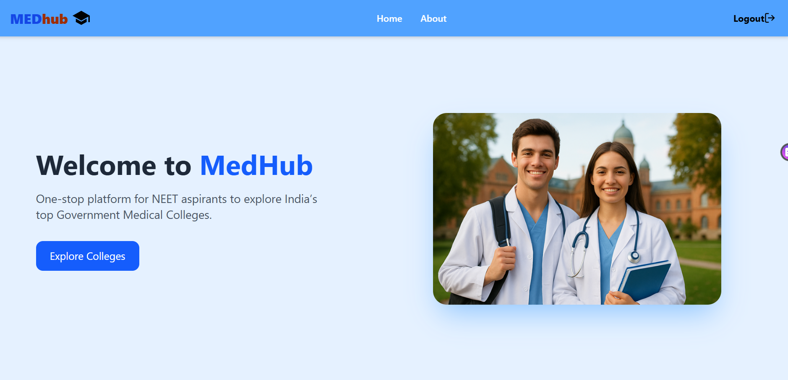
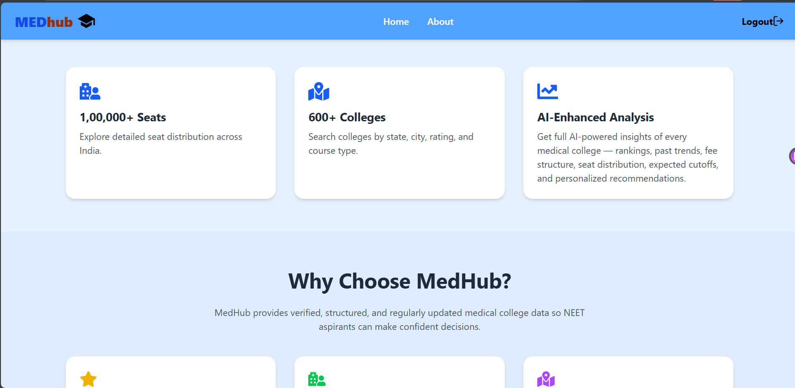
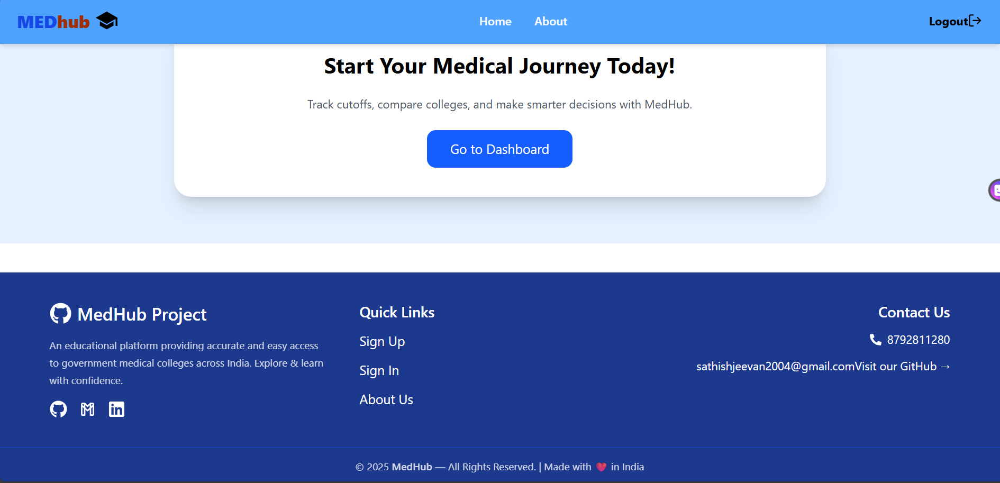
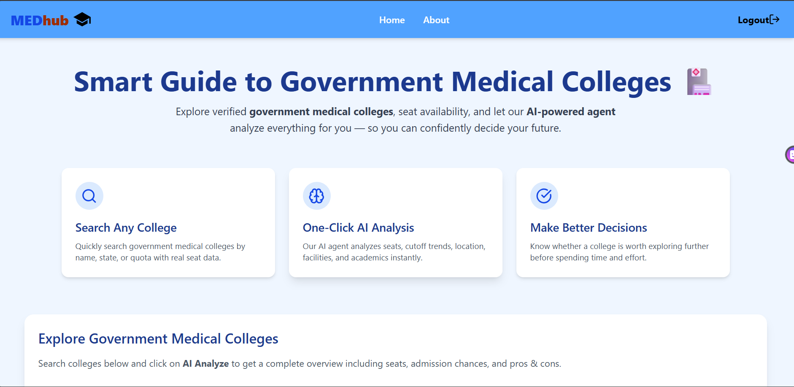
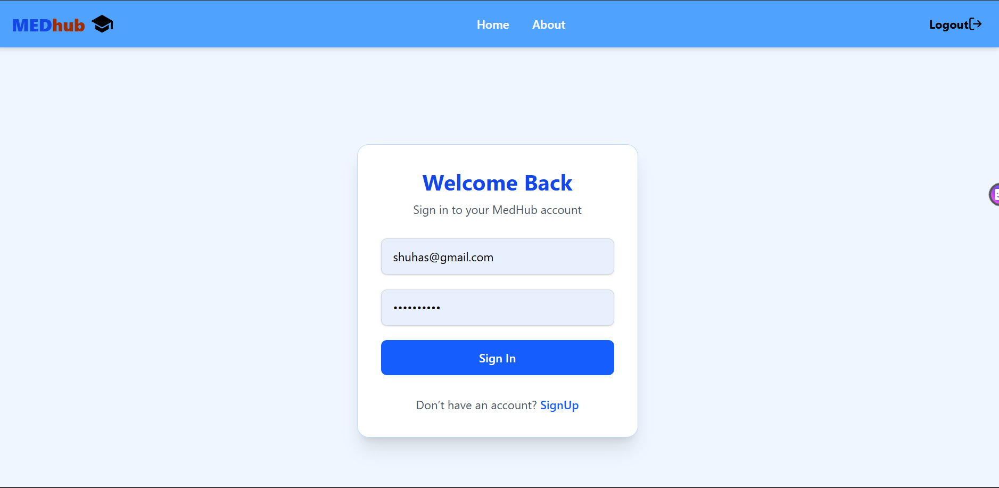
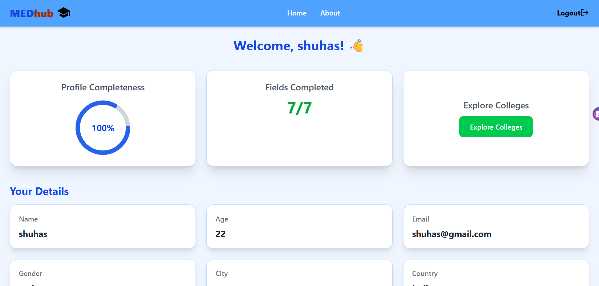
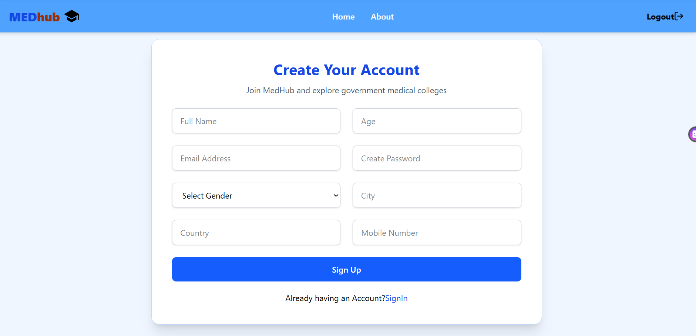
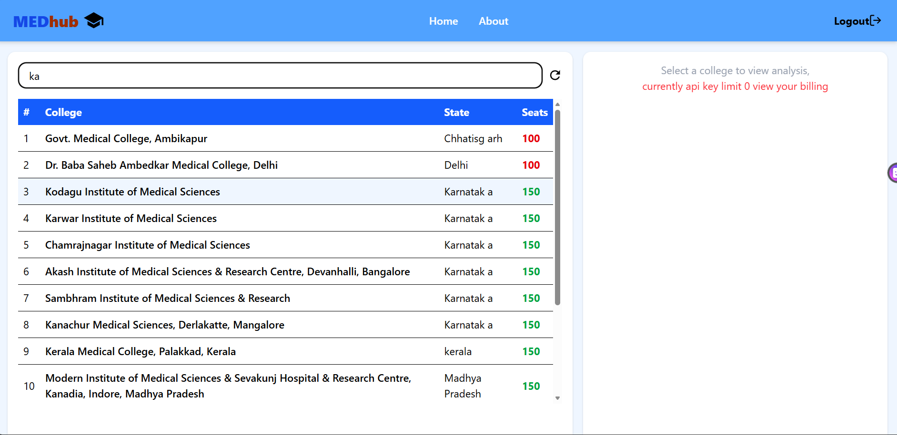
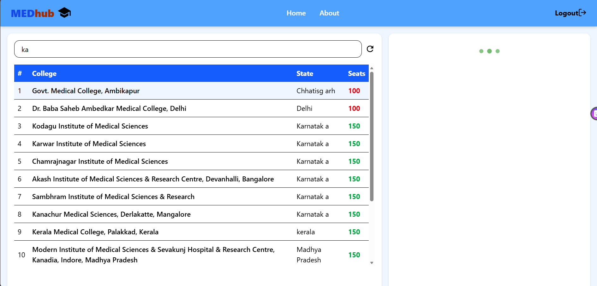

# 🏥 MedHub — Full Stack Medical College Explorer & AI Analyzer

🚀 **MedHub** is a full-stack web application that helps users explore **government medical colleges in India** and get **AI-powered insights** using **Google Gemini AI**.

The platform combines real government data with modern web technologies to deliver a smart, responsive, and user-friendly experience.

---

## 🌟 Project Overview

MedHub allows users to:
- Register and sign in securely
- View a personalized user dashboard
- Explore government medical colleges across India
- Search colleges by name or state
- Get one-click AI analysis of medical colleges
- Receive insights such as overview, seat analysis, and reputation

This project was built to gain real-world experience in **full-stack development**, **API integration**, and **AI-based analysis**.

---

## ✨ Key Features

- 🔐 User Authentication  
- 📊 User Dashboard  
- 🏥 Medical College Data Integration  
- 🔍 Search & Filter Functionality  
- 🤖 AI-Powered College Analysis  
- 📱 Fully Responsive UI  

---

## 🛠 Tech Stack

**Frontend:** React.js, Tailwind CSS  
**Backend:** Node.js, Express.js  
**Database:** PostgreSQL  
**AI:** Google Gemini API  

---

## 📡 APIs Used

- Government Medical Colleges Data API  
- Google Gemini AI API  

---

---

## 🎯 Learning Outcomes

- Full-stack application development
- REST API integration
- AI integration in web applications
- Secure backend architecture
- Responsive UI development

---

## 🤝 Feedback

This project was built for learning and growth.  
Suggestions, feedback, and improvements are always welcome.

---

### 🔖 Tags
`#FullStackDeveloper` `#ReactJS` `#ExpressJS` `#PostgreSQL`  
`#TailwindCSS` `#GeminiAI` `#WebDevelopment` `#StudentProject`
